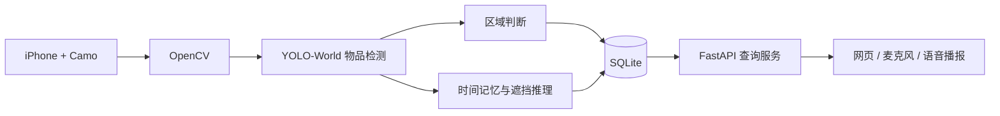

# FindBack

FindBack 是一个在 Windows 本地运行的单摄像头物品记忆原型。它使用 iPhone + Camo 作为摄像头、YOLO-World 识别常见物品、SQLite 保存最后出现位置，并提供支持文字查询、浏览器麦克风输入和中文语音播报的本地网页。

除了回答“杯子最后出现在哪个标定区域”，项目还包含一个实验性的单摄像头遮挡推理模块：系统先记住物品无遮挡时的位置，再根据电脑是否覆盖该位置、物品可见面积是否下降，谨慎推断“杯子可能在电脑后面”。

> 这是原型系统，不应用于安全、医疗、财产保护等高风险场景。单摄像头无法获得可靠的真实三维深度；空间关系是基于当前视角和时间连续性的概率推断。

## 功能

- 使用 iPhone/Camo 或普通摄像头采集实时画面
- 使用 YOLO-World 开放词汇检测物品
- 将画面标定为书桌、地面等自定义区域
- 保存物品名称、区域、置信度、时间和识别快照
- 记忆物品无遮挡时的位置
- 推断物品是否可能被电脑遮挡
- 在本地网页查询“我的杯子在哪里”
- 显示最后识别快照和空间关系证据
- 使用浏览器麦克风进行中文语音提问
- 使用浏览器语音合成播报查询结果
- 自动在 MSMF 与 DirectShow 之间选择可用的 Camo 接口

## 工作流程



遮挡关系的基本证据链：

```text
杯子完整可见
  → 记录无遮挡位置和检测框
  → 电脑覆盖杯子此前位置
  → 杯子可见面积明显下降或完全消失
  → 连续多轮成立
  → 记录“杯子可能在电脑后面”
```

## 环境要求

- Windows 10 或 Windows 11
- Python 3.12
- Git
- iPhone 和数据线（使用其他摄像头时可省略）
- iPhone 上的 Camo Camera
- Windows 上的 Camo Studio
- 推荐使用 Microsoft Edge 或 Google Chrome 打开查询网页

仅使用 CPU 也可以运行，但每轮检测可能需要数秒。NVIDIA GPU 和正确安装的 CUDA 版 PyTorch 可以显著提升速度。

## 安装

```powershell
git clone https://github.com/mingzhelu358-afk/FindBack.git
cd FindBack

py -3.12 -m venv .venv
Set-ExecutionPolicy -Scope Process Bypass
.\.venv\Scripts\Activate.ps1

python -m pip install --upgrade pip
python -m pip install -r requirements.txt
```

YOLO-World 的自定义类别需要 Ultralytics CLIP。如果网络无法访问 GitHub，`requirements.txt` 中的 CLIP 安装可能失败。此时可以下载 `https://github.com/ultralytics/CLIP/archive/refs/heads/main.zip`，解压后在对应目录执行：

```powershell
python -m pip install .
```

模型文件 `yolov8s-world.pt` 不包含在仓库中。第一次运行时 Ultralytics 通常会自动下载；也可以手动放到项目根目录。

## 1. 连接并检查摄像头

1. 在 iPhone 上打开 Camo Camera。
2. 用数据线连接电脑。
3. 在 Windows 上打开 Camo Studio，确认能够看到实时画面。
4. 保持 Camo Studio 运行。

检查可用编号：

```powershell
python .\camera_probe.py
```

预览当前配置的摄像头：

```powershell
python .\camera_view.py
```

按 `Q` 退出预览。如果 Camo 不是编号 `1`，请修改 `camera_view.py`、`calibrate_zones.py` 和 `run_findback_relations.py` 中的 `CAMERA_INDEX`。

`run_findback_relations.py` 会优先尝试 MSMF，如果没有有效画面再尝试 DirectShow。

## 2. 标定区域

把摄像头固定在最终位置。推荐从桌面上方斜向下约 30–45 度拍摄；完成标定后不要移动摄像头。

```powershell
python .\calibrate_zones.py
```

操作方式：

- 在实时预览中按 `S` 截取标定画面
- 鼠标左键添加区域顶点
- `Enter` 完成当前区域
- `U` 撤销最后一个点
- `R` 重画当前区域
- `Q` 退出且不保存

程序会生成本机专用的 `zones.json` 和 `calibration_frame.jpg`。这两个文件可能透露房间布局，因此默认不会提交到 Git。

默认区域名称写在 `calibrate_zones.py` 的 `ZONE_NAMES` 中，可以在标定前修改。

## 3. 运行物品识别与遮挡推理

在第一个 PowerShell 窗口运行：

```powershell
cd $HOME\Desktop\FindBack
.\.venv\Scripts\Activate.ps1
python .\run_findback_relations.py
```

正常启动时会显示类似：

```text
AI运行设备： cpu
正在尝试Camo Camera接口：MSMF……
Camo Camera画面准备完成（MSMF）：1280x720，平均亮度……
FindBack开始运行
```

按 `Q` 退出。

当前默认识别类别：

- keys
- wallet
- eyeglasses
- mobile phone
- backpack
- cup
- book
- bottle
- laptop

可以修改 `run_findback_relations.py` 中的 `OBJECTS`，但类别过多会增加 CPU 推理负担。

## 4. 测试“杯子可能在电脑后面”

测试顺序会直接影响结果：

1. 让杯子完整可见，电脑不要遮挡杯子。
2. 保持约 10–20 秒，让系统记录杯子的无遮挡位置。
3. 确认画面中出现 `cup` 和 `laptop` 检测框。
4. 慢慢把电脑移动到杯子前方。
5. 可以保留杯沿等少量可见部分，也可以完全遮住。
6. 保持约 15–30 秒。

关系成立时终端会输出：

```text
空间关系：cup 可能在laptop后面
```

橙色框表示系统推测的被遮挡物品位置。

## 5. 启动查询网页

保持识别程序运行，在第二个 PowerShell 窗口执行：

```powershell
cd $HOME\Desktop\FindBack
.\.venv\Scripts\Activate.ps1
python .\query_app.py
```

浏览器通常会自动打开。也可以手动访问：

```text
http://127.0.0.1:8000
```

可以输入或说出：

```text
我的杯子在哪里
```

普通回答示例：

```text
杯子最后一次出现在书桌中间。
```

存在遮挡关系时：

```text
杯子最后一次出现在书桌中间，可能在电脑后面，目前估计还能看到20%。
```

第一次点击麦克风按钮时，请允许浏览器使用麦克风。语音输入不受支持时仍可使用文字查询；语音播报使用浏览器自带的 Web Speech API。

## 数据库

`findback.db` 由程序自动创建，包含两个主要表：

- `observations`：物品、区域、检测置信度、时间和快照
- `spatial_relations`：主体物品、关系、参照物、可见比例、关系置信度、状态和证据

查看最近记录：

```powershell
python .\check_db.py
```

数据库和快照默认不会提交到 Git。

## 文件说明

| 文件 | 用途 |
|---|---|
| `run_findback_relations.py` | 主程序：检测、区域判断、数据库写入、遮挡关系 |
| `spatial_reasoning.py` | 单摄像头时间记忆与遮挡推理 |
| `query_app.py` | FastAPI 本地查询服务 |
| `templates/index.html` | 查询、麦克风输入和语音播报界面 |
| `calibrate_zones.py` | 交互式区域标定 |
| `camera_probe.py` | 搜索可用摄像头编号 |
| `camera_view.py` | 摄像头预览 |
| `camera_diagnostic.py` | 测试摄像头编号和 Windows 视频后端 |
| `init_db.py` | 初始化基础数据库表 |
| `check_db.py` | 查看数据库记录 |
| `run_findback.py` | 不含空间关系的基础识别版本 |
| `detect.py` | 早期的单帧/基础检测实验 |

## 常见问题

### Camo 窗口是黑色

- 先确认 Camo Studio 自己能看到 iPhone 画面
- 关闭 Windows 相机、Zoom、Teams 等可能占用摄像头的软件
- 不要同时运行多个 FindBack 摄像头程序
- 运行 `camera_diagnostic.py` 比较 MSMF 与 DirectShow
- 当前主程序会自动尝试两种后端

### 提示没有 `zones.json`

先运行：

```powershell
python .\calibrate_zones.py
```

### 提示 `No module named 'clip'`

说明 Ultralytics CLIP 没有安装。重新安装 `requirements.txt` 中的 Git 依赖，或者下载 ZIP 后在解压目录运行 `python -m pip install .`。

### 没有判断出遮挡关系

- 先让物品完整可见，使系统获得无遮挡记忆
- 确认杯子和电脑都被正确识别
- 缓慢移动电脑并保持数轮检测
- 当前版本每个类别只保留置信度最高的一个实例，多只同类物品可能混淆
- 单摄像头不能可靠恢复真实三维深度，系统只在证据足够时输出“可能”

### CPU 运行很慢

- 减少 `OBJECTS` 类别数量
- 降低 `imgsz`
- 使用支持 CUDA 的 NVIDIA GPU 和对应的 PyTorch
- 将识别频率与界面刷新频率解耦

## 隐私与仓库内容

以下内容默认被 `.gitignore` 排除：

- Python 虚拟环境
- 模型权重
- SQLite 数据库
- 识别快照
- 标定照片和区域坐标
- 缓存和本机配置

提交代码前仍应执行 `git status`，确认没有私人照片、数据库、密钥或个人路径被加入暂存区。

## 当前限制

- 目前面向 Windows 和 Camo 工作流
- 仅针对固定单摄像头视角
- 不是通用三维空间理解系统
- 遮挡判断依赖历史检测框，可能受误检和检测抖动影响
- 每个类别目前只跟踪置信度最高的实例
- 浏览器语音识别的可用性取决于 Edge/Chrome 和系统服务

## 后续方向

- 使用实例分割代替矩形检测框
- 加入单目深度估计作为辅助证据
- 支持同类别多实例跟踪
- 增加第二摄像头交叉确认
- 将检测和网页服务整合为一个可启动应用
- 提供可编辑的区域与物品管理页面

## 依赖与许可提醒

本项目依赖 Ultralytics、PyTorch、OpenCV、FastAPI 等第三方组件。部署、分发或商用前，请分别检查这些项目及模型权重的许可证要求；尤其需要注意 Ultralytics 的许可条款。
